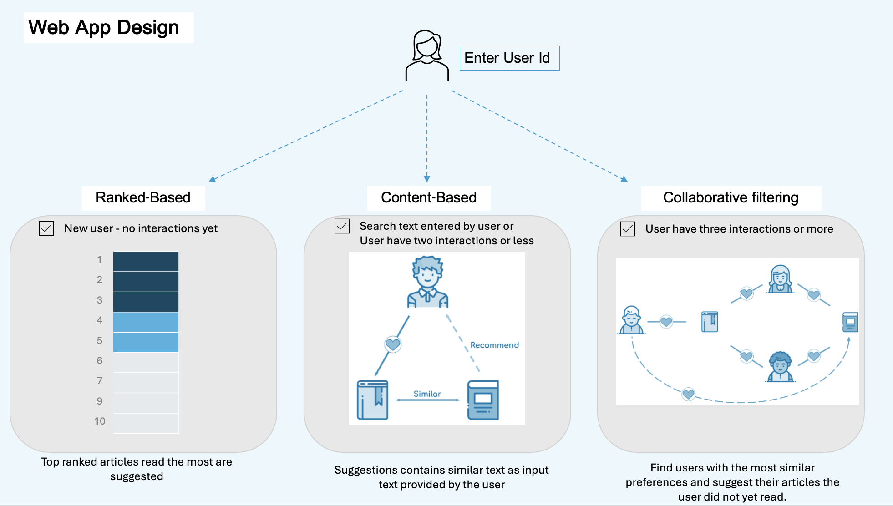
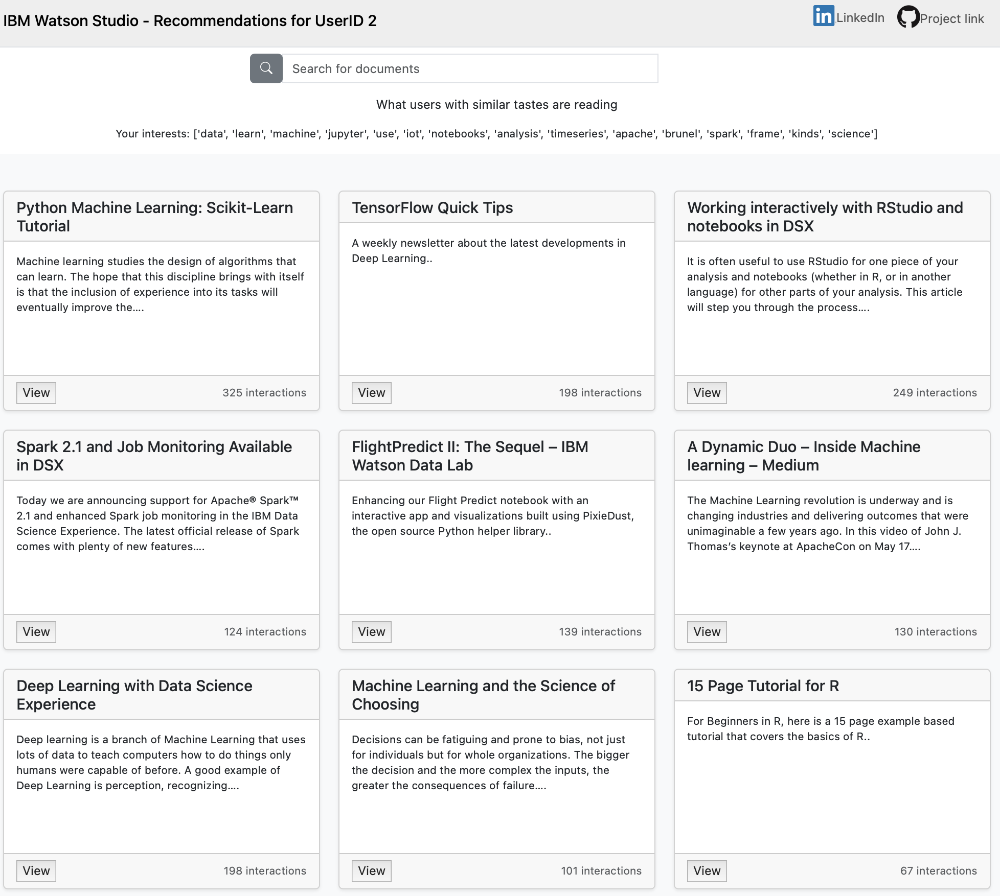
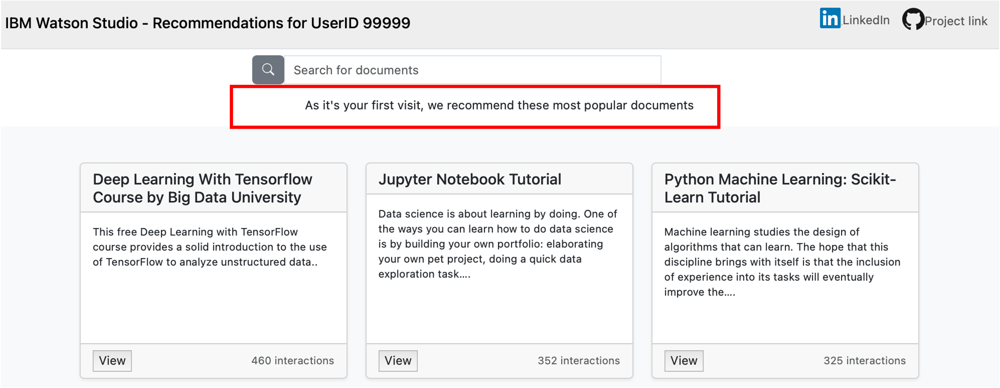
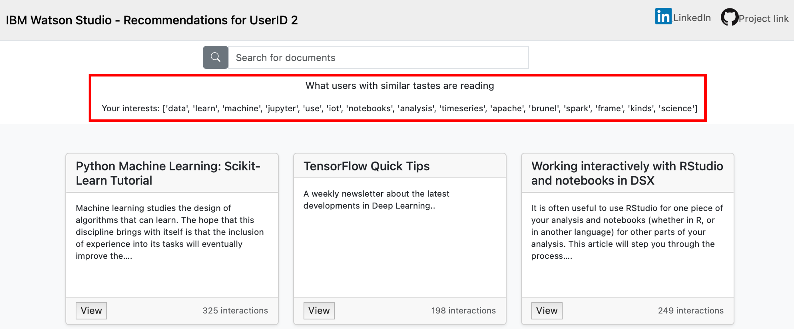
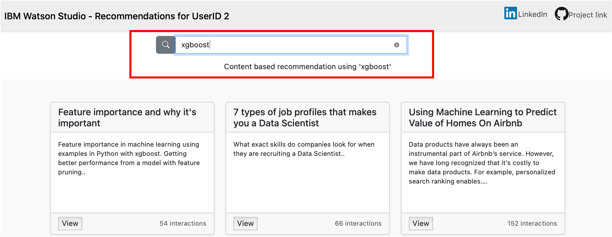

## Udacity Data Science Nanodegree
---
## Portfolio Exercise: Recommendation Engines
Use a blend of recommendation techniques such rank-based, collaborative filtering,
content-based, and matrix factorization
to recommend documents to a user to read next.

[//]: # ()

#### Created by: Juanita Smith
#### Last date: March 2025
---

### Table of contents
<!-- TOC -->
* [1. Project Motivation](#1-project-motivation)
* [2. Skills applied in this project](#2-skills-applied-in-this-project)
* [3. Installation](#3-installation)
* [4. Input File Descriptions](#4-input-file-descriptions)
    * [Cleaning Activities:](#cleaning-activities)
* [5. Notebook Instructions](#5-notebook-instructions)
* [6. Flask Wep App Instructions](#6-flask-wep-app-instructions)
    * [Instructions how to run the web app:](#instructions-how-to-run-the-web-app)
* [7. Unit tests](#7-unit-tests-optional)
* [8. Licensing, Authors, Acknowledgements](#8-licensing-authors-acknowledgementsa-namelicensinga)
<!-- TOC -->

# 1. Project Motivation

Project and data was sponsored by [IBM Cloud](https://eu-gb.dataplatform.cloud.ibm.com/).

In the IBM Watson Studio, there is a large collaborative community ecosystem of articles, datasets, notebooks, 
and other AI and ML assets.

This project analyse the interactions
that users have with articles on the IBM Watson Studio platform,
and make recommendations to them about new articles they might be interested in.

The project consist of two parts:
1) A [notebook]('https://github.com/JuanitaSmith/recommendations_documents/blob/main/notebooks/Recommendations_with_IBM.ipynb') 
which satisfies Udacity's minimum requirements to pass the project.
   Here data is first explored and cleaned,
   then various recommendation approaches are explored and evaluated.
2) Webapp which builds upon the learnings of the notebook to recommend the best articles to users.

# 2. Skills applied in this project

- Web Development using Flask and Bootstrap
- Clean and modular code, see custom modules and classes
- Automated unit testing using library `unittest`, see folder `tests`
- Logging: see folder `logging` for logging results
- Object-Oriented Programming - see `src/recommender.py` for custom recommender class
- Applying the right recommendation technique for the right scenario:

    - Rank-Based Recommendations for new users without any interactions.
    - User-User Based Collaborative Filtering where we have lots of history of interactions.
    - Content-Based Recommendations, using NLP techniques to search for documents with similar texts
    - Matrix Factorization to explore the hidden relationships and patterns through latent features.

# 3. Installation
To clone the repository. use `git clone https://github.com/JuanitaSmith/recommendations_documents`

- Project environment was built using Anaconda.
- Python 3.10 interpreter was used.
- Refer to `requirements.txt` for libraries and versions needed to build your environment.
- Refer to `environment.yaml` for environment setup and conda channels used

# 4. Input File Descriptions

- Two files were provided by Udacity and [IBM](https://eu-gb.dataplatform.cloud.ibm.com/), and stored in the `data` folder.

1. `articles_community.csv` -> Contains the **content** of each article:
   - `article_id`: unique key identifying each document
   - `doc_body`: main text of the article
   - `doc_description`: short summary of the article
   - `doc_full_name`: title of the document
   - `doc_status`: contains value "Live" for all records 

2. `user_item_interactions.csv` -> Describes **interactions**; which users read which documents.
   - `article_id`: unique key identifying each document
   - `title`: lower case version of doc_full_name above
   - `email`: encoded email uniquely identifying a user

### Cleaning Activities:
- Drop duplicate article_ids from contents
- Drop interactions where the article is not present in the contents (webapp only)
- Convert email into a numerical user_id field
- Drop null values `doc_description` and `doc_body`

# 5. Notebook Instructions

The notebook
that contains the minimum requirements to pass the project can be found in `notebooks\Recommendations_with_IBM.ipynb`.

The notebook is broken down into 5 sections:

I. Exploratory Data Analysis 
II.
Rank Based Recommendations 
III.
User-User Based Collaborative Filtering 
IV. Content Based Recommendations  
V. Matrix Factorization

# 6. Flask Wep App Overview

The web app is not hosted, and should be run locally.
It was developed using Flask and [Bootstrap](https://getbootstrap.com)

### Instructions how to run the web app:

1) In the project's root directory run `run.py` in your shell.
2) In your web browser, go to `http://localhost:3001` to view the site.
3) Enter a valid user id (from the [interactions dataset](data/user_item_interactions_clean.csv))  
4) Recommendations will be calculated using a blend of techniques: 
   #### 4a) **Rank-based** for users without any interactions, showing the articles with the most interactions.

    Status bar indicate the type of user and recommendation technique used.
  
     
   
    #### 4b) Collaborative filtering for users with at least three interactions.

      This approach finds similar users
who read the same documents as the input user
        and propose documents these similar users have read.
   Status bar indicates that collaborative filtering was used,
   and a list of most frequently read nouns and verbs from article titles gives us a clue
   what the user is interested in.

   **Dot product** is used as the similarity metrics.

    

    #### 4c) **Content-based** recommendations based on search terms the user enter.

    If a user has less than three interactions,
    the titles of the articles read will be used as the search term
    to search for similar documents.
    
    This approach use NLT techniques
        to find documents with similar words as the search text
        using **cosine similarity**.

    

A log file `logs\log.log` will be created during execution
to track interaction with the webapp.

A configuration file `src/config.pg` contains defaults for the project structure and file paths. 
Ideally do not change this structure.

# 7. Unit tests

To run unittests run command `python -m unittest tests.test_recommender` in the root of your project in the terminal.

# 8. Licensing, Authors, Acknowledgements

Must give credit to IBM for the data and project using real world data

